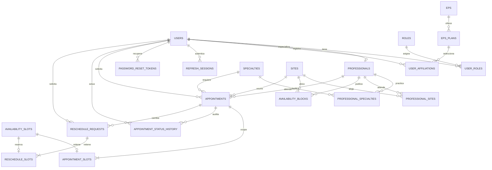

# Diseño relacional propuesto — Sistema académico de citas

**Estado:** propuesta basada en PRD v1.0 y requisitos 3FN. No usa ni sustituye `database/reference/`; comparar únicamente cuando el trainer autorice esa referencia.

## Diagrama lógico

## Entidades y dependencias funcionales principales

- `USERS(user_id, document_type, document_number, email, first_name, last_name, phone, password_hash, created_at)`; `user_id →` atributos. `document_number` y email normalizado son claves candidatas únicas.
- `ROLES(role_id, code)`; `role_id → code`, `code` único. `USER_ROLES(user_id, role_id)` tiene PK compuesta; no incluye atributos descriptivos del usuario/rol.
- `PROFESSIONALS(professional_id, user_id, professional_code, license_number, active)`; `professional_id →` atributos y `user_id` único. Sedes/especialidades son N:M y viven en puentes.
- `SPECIALTIES(specialty_id, name, duration_minutes, active)`; `specialty_id →` atributos, duración restringida a 30/60.
- `SITES(site_id, code, name, address)` es catálogo fijo. Sus dos filas se cargan como seed del proyecto.
- `PROFESSIONAL_SPECIALTIES(professional_id, specialty_id, is_primary)`; la PK compuesta determina `is_primary`. Restricción adicional: como máximo una especialidad primaria por profesional.
- `PROFESSIONAL_SITES(professional_id, site_id)` resuelve N:M.
- `EPS(eps_id, name, active)`; `EPS_PLANS(plan_id, eps_id, name, active)`; identificadores determinan atributos propios del catálogo. Nombre de plan único dentro de EPS.
- `USER_AFFILIATIONS(affiliation_id, user_id, plan_id, created_at)` vincula afiliación sin duplicar EPS/régimen/plan en usuario. Si el dominio requiere historial, retirar unicidad por usuario y agregar vigencia; decisión no especificada aún.
- `AVAILABILITY_BLOCKS(block_id, professional_id, site_id, starts_at, ends_at)` representa publicación editable; los slots materializados tienen su identificador y `starts_at`. Unicidad por profesional/inicio, más validación transaccional de solapamiento.
- `APPOINTMENTS(appointment_id, user_id, professional_id, specialty_id, site_id, starts_at, appointment_type, status, rejection_reason, created_at)`; `appointment_id →` atributos. La duración es derivada de la especialidad, no se duplica. El motivo solo se llena al rechazar.
- `APPOINTMENT_SLOTS(appointment_id, slot_id)` PK por cita-slot y `slot_id` único para evitar doble retención.
- `APPOINTMENT_STATUS_HISTORY(history_id, appointment_id, new_status, actor_user_id?, source, occurred_at, reason?)` es append-only; no se edita como CRUD normal.
- `RESCHEDULE_REQUESTS(request_id, appointment_id, requested_by, requested_start, status, reason?, decided_by?, decided_at?)` retiene una propuesta mientras la cita original sigue intacta. `RESCHEDULE_SLOTS(request_id, slot_id)` impide compartir la reserva provisional con otra cita o solicitud.
- `REFRESH_SESSIONS(session_id, user_id, token_hash, expires_at, revoked_at?, rotated_from?, created_at)` y `PASSWORD_RESET_TOKENS(reset_id, user_id, token_hash, expires_at, consumed_at?)` representan credenciales temporales sin persistir tokens en claro. La política exacta de refresh debe aprobarse antes de migrar.

## Justificación 1FN → 2FN → 3FN

1. **1FN:** cada columna contiene un valor atómico; roles, sedes, especialidades y slots múltiples se separan en filas puente/relación. No se guardan listas separadas por coma.
2. **2FN:** en relaciones con PK compuesta (`USER_ROLES`, `PROFESSIONAL_SPECIALTIES`, `PROFESSIONAL_SITES`, `APPOINTMENT_SLOTS`, `RESCHEDULE_SLOTS`), atributos de relación como `is_primary` dependen de la clave completa; los demás datos residen en su entidad.
3. **3FN:** nombres de EPS/plan, rol, sede y especialidad viven en su catálogo. Los hechos de cita guardan FKs, no etiquetas duplicadas. La duración es derivable por especialidad. El historial conserva estado/motivo/actor del evento porque son hechos temporales, no una copia de campos del usuario.

## Reglas de integridad que debe respaldar el esquema y la aplicación

- Email y tipo/número de documento únicos; roles múltiples mediante puente.
- Restricción única de cada slot activo, además de reserva transaccional y liberación en rechazo/cancelación.
- Para 60 minutos, reservar dos slots consecutivos del mismo profesional, sede y especialidad.
- Cita especializada pendiente y reprogramación pendiente mantienen reservas explícitas; al aprobar reprogramación se intercambian en una transacción.
- Bloques no se solapan; slots comprometidos no se eliminan.
- Estados fijos con transiciones validadas; bitácoras inmutables.

## Índices a evaluar

- `USERS(email)` único; `USERS(document_type, document_number)` único.
- `AVAILABILITY_SLOTS(professional_id, starts_at)` único; índice de inicio para filtros de fecha.
- `APPOINTMENTS(user_id, status, starts_at)`, `(professional_id, status, starts_at)` y `(site_id, status, starts_at)`.
- `APPOINTMENT_STATUS_HISTORY(appointment_id, occurred_at)`.
- `RESCHEDULE_REQUESTS(status, requested_start)`.
- Índices de FK en tablas puente/afiliaciones según consultas observadas.

## Preguntas que requieren cierre

- ¿La afiliación es única actual o debe conservar varias históricas? PRD dice asociar afiliación y no define historial.
- ¿La sede se fija al crear cita según el bloque reservado? El PRD filtra por sede y el bloque tiene sede; aquí se propone FK de sede en cita como snapshot relacional de la atención.
- ¿Qué campos exactos de profesionales/citas requieren snapshot para historial? Debe acordarse antes de congelar auditoría.
- ¿Qué estados/transiciones adicionales y quién puede ejecutarlos? Mantener solo los definidos por PRD hasta decisión.
- Política refresh-token pendiente de decisión de seguridad.
